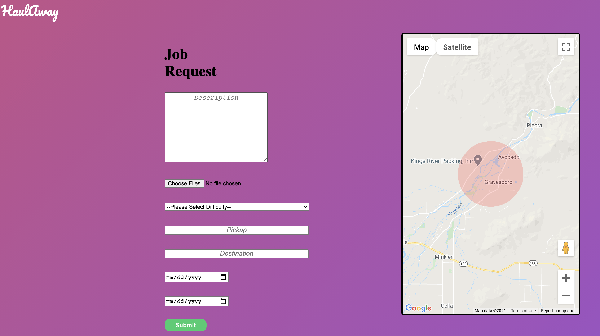
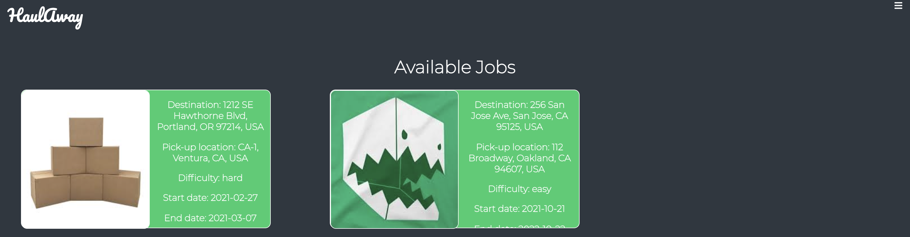

# HaulAway

HaulAway is a user-to-user service that helps alleviate the difficulties of moving _haul_ from one destination to the next. I

# Technologies Used

[MongoDB](https://www.mongodb.com/)
[Express](https://expressjs.com/)
[React](https://reactjs.org/)
[Node](https://nodejs.org/en/)
[AWS S3](https://aws.amazon.com/s3/)
[google-maps-react](https://www.npmjs.com/package/google-maps-react)
[react-google-autocomplete](https://www.npmjs.com/package/react-google-autocomplete)
[multer](https://www.npmjs.com/package/multer)

# Features

1. User Auth

We built a User Authentication system to access the job form and display your job in the index. Users can upload a profile picture that stores into our AWS S3 bucket.

2. Job Postings

Users have to submit a form with required fields and pass validations to submit a job.

3. Google Maps

Googles Maps is dynamic to show where a destination or pickup can be depending on the page. A circle property is also included in the map to help visualize the location.

4. AWS

Users have the ability to upload multiple photos at once and those images are uniquely stored in their information.

# The Brilliant Team

[Joshua C. Sadsad](https://github.com/jsadsad/): Team Lead
[Lena Shin](https://github.com/shinara03): Backend Lead
[Fabio R. Bortone](https://github.com/kinda-dev): Frontend Lead
[Dmitrii An](https://github.com/andmitriy93): Flex

# Future Incorporations

- [ ] User private messaging system
- [ ] Calculate fees depending on distance
- [ ] User average ratings

## References

[Uploading-to-S3](https://paulrohan.medium.com/file-upload-to-aws-s3-bucket-in-a-node-react-mongo-app-and-using-multer-72884322aada)
