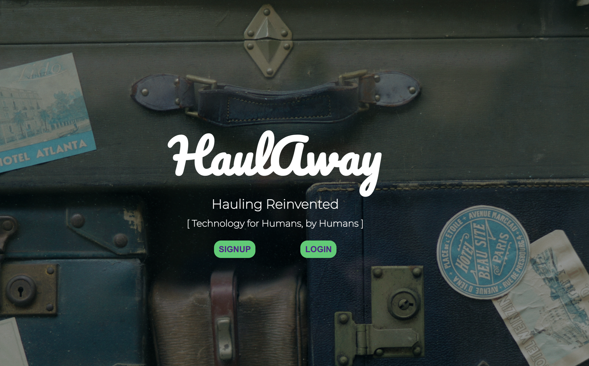
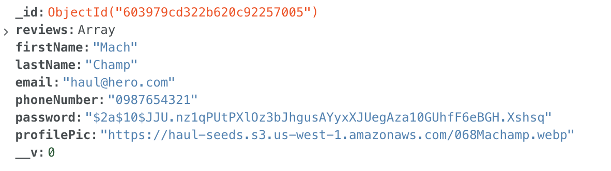
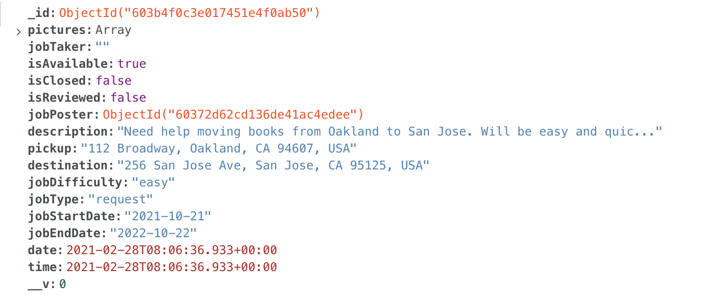
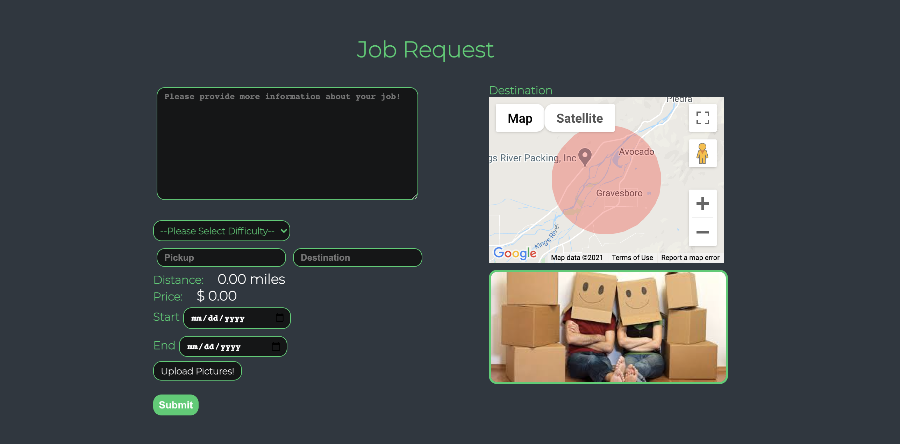
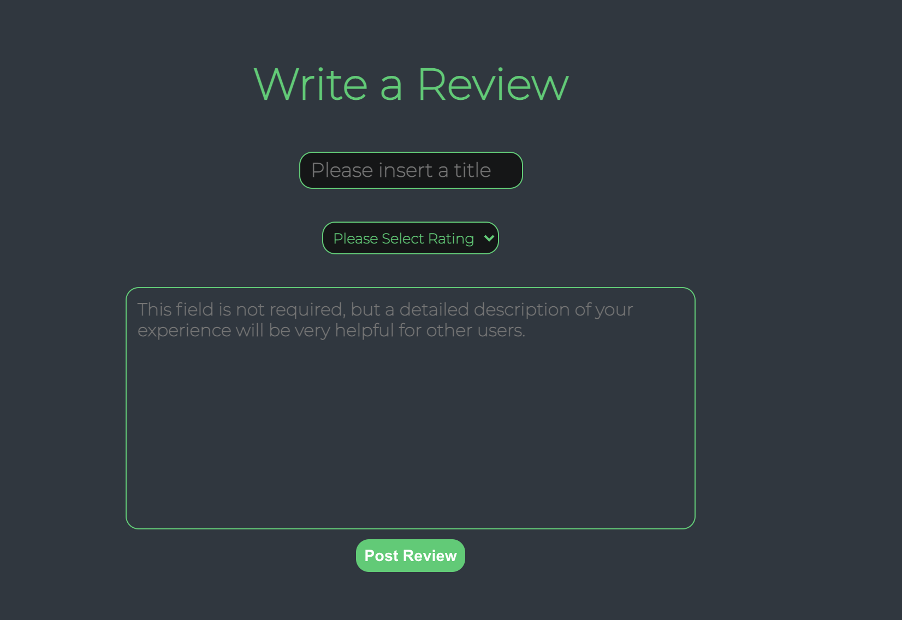

# HaulAway

[Live!](https://haulaway.herokuapp.com/#/)

# Summary

_HaulAway_ is a user-to-user service that helps alleviate the difficulties of moving _haul_ from one destination to the next.

We all know the struggles of moving. It takes a considerable amount of time signing up for moving services and find out the right vehicle sizes and price plans. With _HaulAway_, we make that simpler.

Every information is stored in our NoSQL document-oriented _Mongo_ database. _Express_ is used for our backend routing to simplify the task of writing server code. _React_ is the tool used for creating views rendered in HTML. Lastly with _Node_, JavaScript is able to be implemented in the backend mainly used to handle server-side requests.




# The Brilliant Team

[Joshua C. Sadsad](https://github.com/jsadsad/): Lead

[Lena Shin](https://github.com/shinara03): Backend

[Fabio R. Bortone](https://github.com/kinda-dev): Frontend

[Dmitrii An](https://github.com/andmitriy93): Flex

# Technologies Used

| Backend                                        | Frontend                                                             |
| ---------------------------------------------- | -------------------------------------------------------------------- |
| [MongoDB](https://www.mongodb.com/)            | [React](https://reactjs.org/)                                        |
| [Express](https://expressjs.com/)              | [google-maps-react](https://www.npmjs.com/package/google-maps-react) |
| [Node](https://nodejs.org/en/)                 | [react-google-autocomplete](https://www.npmjs.com/package/)          |
| [multer](https://www.npmjs.com/package/multer) | [react-geocode](https://www.npmjs.com/package/react-geocode)         |
| [AWS S3](https://aws.amazon.com/s3/)           | [geolib](https://www.npmjs.com/package/geolib)                       |

# Features

1. User Auth

We implemented a User Authentication system to access the job form and display the respective job in an index. Users are required to upload a profile picture that stores into our AWS S3 bucket.




2. Job Postings

Users have to submit a form with required fields and pass validations to submit a job. In the Job Index, only available jobs are shown through a `selector`.

```
export const getAvailableJobs = (state) => {
  return Object.values(state.entities.jobs).filter((job) => job.isAvailable)
}
```



3. Google Maps

Googles Maps is dynamically supported to show where a destination or pickup can be depending on the route. A _Circle_ prop is included in the map to help visualize the location. On the job form, there is a default location until the Destination is submitted. Using `geolib`, distance is calculated from Pickup to Destination.

```
  onDestinationSelected(place) {
    const address = place.formatted_address,
      latValue = place.geometry.location.lat(),
      lngValue = place.geometry.location.lng()
    this.setState({
      destinationCoords: {
        lat: latValue,
        lng: lngValue,
      },
      destination: address ? address : '',
      markerPosition: {
        lat: latValue,
        lng: lngValue,
      },
      mapPosition: {
        lat: latValue,
        lng: lngValue,
      },
    })
  }
```



4. AWS

Users have the ability to upload multiple photos at once and images are uniquely stored in the User's document.

```
router.post('/uploads', upload.array('file', 12), (req, res) => {
  const file = req.files
  let s3bucket = new AWS.S3({
    accessKeyId: process.env.AWS_ACCESS_KEY_ID,
    secretAccessKey: process.env.AWS_SECRET_ACCESS_KEY,
    region: process.env.AWS_REGION,
  })
  s3bucket.createBucket(function () {
    let ResponseData = []

    file.map((item) => {
      let params = {
        Bucket: process.env.AWS_BUCKET_NAME,
        Key: item.originalname,
        Body: item.buffer,
        ACL: 'public-read',
      }
      s3bucket.upload(params, function (err, data) {
        if (err) {
          res.json({ error: true, Message: err })
        } else {
          ResponseData.push(data)
          if (ResponseData.length == file.length) {
            res.json({
              Message: 'File Uploaded successfully',
              Data: ResponseData,
            })
          }
        }
      })
    })
  })
})
```


5. Reviews

Once 2 Users (1 Job Poster and 1 Job Taker) have interacted and closed a job, they now have the ability to review each other. Reviews are then able to be updated or deleted.

```
  reviewJobButtons() {
    const job = this.props.job
    if (!job.reviews.includes(this.props.currentUserId)) {
      if (
        (job.jobPoster._id === this.props.currentUserId ||
          job.jobTaker === this.props.currentUserId) &&
        job.isClosed
      ) {
        return (
          <div className="review-job-buttons">
            <div className="review-buttons-title">
              Would you like to review this transaction?
            </div>
            <div className="review-job-buttons-inner-wrap">
              <Link to={`/jobs/${job._id}/review`} job={job}>
                <button className="yes-review-button">YES</button>
              </Link>
              <button
                className="no-review-button"
                onClick={(e) => this.handleClick('noReviewJob', e)}
              >
                NO
              </button>
            </div>
          </div>
        )
      }
    }
  }
```



# Future Incorporations

- [ x ] User Average Ratings
- [ x ] Calculate Fees Depending on Distance
- [ ] User Private Messaging

## References Used

[Why-Use-MongoDB](https://www.mongodb.com/why-use-mongodb)

[Uploading-to-S3](https://paulrohan.medium.com/file-upload-to-aws-s3-bucket-in-a-node-react-mongo-app-and-using-multer-72884322aada)

[HTML Entities](https://www.toptal.com/designers/htmlarrows/symbols/)
